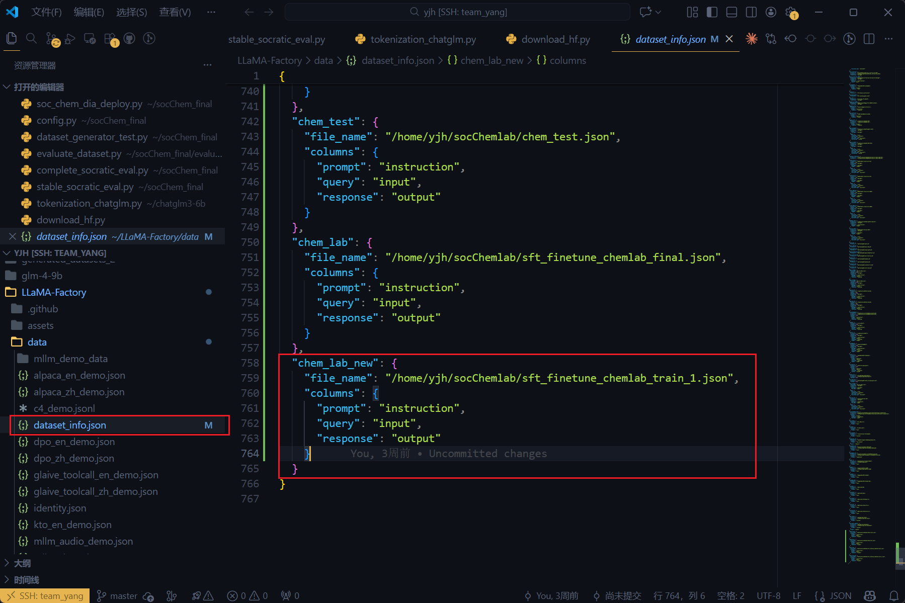

# 1. 环境配置
```python
pip install -r requirements.txt
```

# 2. 数据生成
将实验数据转换为xdl格式数据，见experiments文件夹
```python
# 单一xdl文件生成对话数据
python soc_chem_dia_refactored.py

# 批量生成
python batch_runner_v2.py
```
生成数据见finetune_data_dataset

# 3. 模型微调
将数据转换为alpaca格式，通过llama factory进行lora微调(6张rtx 3090)


# 4. 模型评估
```python
python eval_full_metrics.py

python eval_sochem_v25_production.py

python evaluate_safe.py

```
